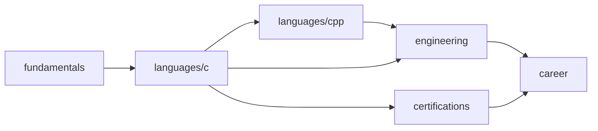

# Dev Handbook — 程序员知识库

> 系统化计算机基础、编程语言、软件工程、职场发展与等级考试的公开教程体系。

## 愿景

把多年编程实践中依赖的积累整理成**可学习、可检索、可贡献**的知识库。每篇教程遵循「概念 → 原理 → 示例 → 练习」结构，适合自学与教学参考。

## 五大主题

| 主题 | 目录 | 说明 |
|------|------|------|
| 计算机基础 | [fundamentals/](fundamentals/) | 数据结构、组成原理、操作系统、网络、数据库 |
| 编程语言 | [languages/](languages/) | 按语言组织的系统教程、速查与示例 |
| 软件工程 | [engineering/](engineering/) | Git、Linux、测试、CI/CD、架构等 |
| 职场发展 | [career/](career/) | 职业路径、面试、沟通、成长 |
| 等级考试 | [certifications/](certifications/) | 高校课程、计算机等级、软考、行业认证 |

## 推荐学习路径

1. **零基础**：从 [languages/c/](languages/c/) 入门，配合 [fundamentals/01-data-structures/](fundamentals/01-data-structures/) 理解基础概念
2. **C 基础上进阶**：完成 C 核心语法后进入 [languages/cpp/](languages/cpp/)，学习面向对象与 STL
3. **备考 C 语言期末**： [certifications/university/c-language/](certifications/university/c-language/) → [languages/c/exams/](languages/c/exams/)
4. **在职提升**： [engineering/01-git-and-collaboration/](engineering/01-git-and-collaboration/) + [engineering/02-linux-and-shell/](engineering/02-linux-and-shell/)

## 当前内容

| 模块 | 状态 | 入口 |
|------|------|------|
| C 语言教程（15 篇） | 已发布 | [languages/c/](languages/c/) |
| C 语言速查（14 篇） | 已发布 | [languages/c/references/](languages/c/references/) |
| C 语言期末考试题库 | 已发布 | [languages/c/exams/](languages/c/exams/) |
| C++ 教程（15 篇） | 已发布 | [languages/cpp/](languages/cpp/) |
| C++ 速查（14 主题） | 已发布 | [languages/cpp/references/](languages/cpp/references/) |
| C++ 期末考试题库 | 已发布 | [languages/cpp/exams/](languages/cpp/exams/) |
| TypeScript 教程 | 骨架/计划中 | [languages/typescript/](languages/typescript/) |
| 数据结构 | 已发布 | [fundamentals/01-data-structures/](fundamentals/01-data-structures/) |
| 组成原理 / OS / 网络 / 数据库 | 已发布 | [fundamentals/](fundamentals/) |
| Git 与协作 | 首批发布 | [engineering/01-git-and-collaboration/](engineering/01-git-and-collaboration/) |
| Linux 与 Shell | 首批发布 | [engineering/02-linux-and-shell/](engineering/02-linux-and-shell/) |

完整路线图见 [docs/roadmap.md](docs/roadmap.md)。

## 贡献

欢迎 Issue 与 Pull Request。写作规范见 [CONTRIBUTING.md](CONTRIBUTING.md) 与 [docs/style-guide.md](docs/style-guide.md)。

## 许可

教程内容采用 [CC BY-SA 4.0](LICENSE) 许可；代码示例可自由使用。
