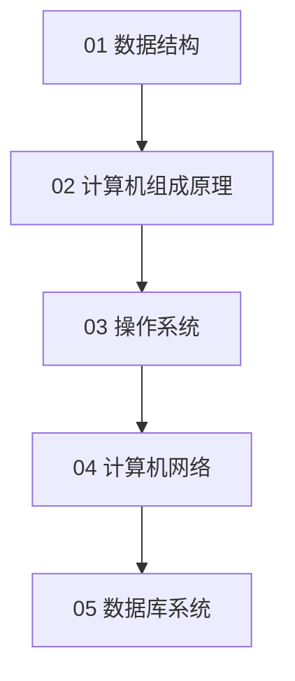

# 计算机基础

按计算机专业核心课程划分五大专题，建议与 [languages/c/](../languages/c/) 并行学习。

## 学习路径

数据结构可与 C 语言数组、指针、链表同步推进；组成原理 → OS → 网络 → 数据库宜按序建立整体图景。

## 章节目录

| 序号 | 专题 | 状态 | 说明 |
|------|------|------|------|
| 01 | [data-structures](01-data-structures/) | 已发布 | 线性表、树、图；复杂度、排序、查找 |
| 02 | [computer-architecture](02-computer-architecture/) | 已发布 | 系统层次、数据表示、Cache、CPU |
| 03 | [operating-systems](03-operating-systems/) | 已发布 | 进程、内存、文件、同步 |
| 04 | [networking](04-networking/) | 已发布 | 分层、TCP/IP、HTTP、DNS |
| 05 | [databases](05-databases/) | 已发布 | SQL、索引、事务、扩展 |

## 章节结构

每专题包含 `guides/`（教程）、`references/`（速查）、`exercises/`（练习）。

## 关联

- 语言教程：[languages/](../languages/)
- 面试：[career/interview/](../career/interview/)
- 工程实践：[engineering/02-linux-and-shell/](../engineering/02-linux-and-shell/)
