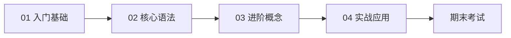

# C 语言

> 系统化 C 语言教程：两周学习指导（含 15 篇专栏全文）+ 14 主题速查 + 示例代码 + 期末考试题库

## 学习路径

| 阶段 | 入口 | 说明 |
|------|------|------|
| 两周计划 + 系统教程 | [学习指导/C语言两周学习指导.md](学习指导/C语言两周学习指导.md) | 14 天计划 + 附录 15 篇专栏全文 |
| 入门基础 | [附录 guide-01～04](学习指导/C语言两周学习指导.md#guide-01) | 4 篇 |
| 核心语法 | [附录 guide-05～09](学习指导/C语言两周学习指导.md#guide-05) | 5 篇 |
| 进阶概念 | [附录 guide-10～12](学习指导/C语言两周学习指导.md#guide-10) | 3 篇 |
| 实战应用 | [附录 guide-13～15](学习指导/C语言两周学习指导.md#guide-13) | 3 篇 |

完整大纲见 [syllabus.md](syllabus.md)。

## 内容索引

| 类型 | 入口 | 说明 |
|------|------|------|
| 系统教程 / 两周计划 | [学习指导/C语言两周学习指导.md](学习指导/C语言两周学习指导.md) | 按天练习 + 附录专栏全文 |
| 语法速查 | [references/](references/) | 14 主题分册 |
| 代码示例 | [examples/](examples/) | 按 chapter01～chapter15 分章 |
| 练习题 | [exercises/](exercises/) | 日常练习（待补充） |
| 期末考试 | [exams/](exams/) | 题库、大纲、复习计划 |
| 考试专题 | [certifications/university/c-language/](../../certifications/university/c-language/) | 考点对照与备考指南 |

## 教程目录

正文与附录均在同一文件：[C语言两周学习指导.md](学习指导/C语言两周学习指导.md)。

### 01 入门基础

| 序号 | 文章 |
|------|------|
| 01 | [C语言入门：为什么它是编程的基石](学习指导/C语言两周学习指导.md#guide-01) |
| 02 | [开发环境搭建](学习指导/C语言两周学习指导.md#guide-02) |
| 03 | [Hello World 背后的执行原理](学习指导/C语言两周学习指导.md#guide-03) |
| 04 | [数据类型与变量](学习指导/C语言两周学习指导.md#guide-04) |

### 02 核心语法

| 序号 | 文章 |
|------|------|
| 05 | [运算符与表达式](学习指导/C语言两周学习指导.md#guide-05) |
| 06 | [流程控制](学习指导/C语言两周学习指导.md#guide-06) |
| 07 | [循环结构](学习指导/C语言两周学习指导.md#guide-07) |
| 08 | [数组与字符串](学习指导/C语言两周学习指导.md#guide-08) |
| 09 | [函数](学习指导/C语言两周学习指导.md#guide-09) |

### 03 进阶概念

| 序号 | 文章 |
|------|------|
| 10 | [指针](学习指导/C语言两周学习指导.md#guide-10) |
| 11 | [内存管理](学习指导/C语言两周学习指导.md#guide-11) |
| 12 | [结构体与共用体](学习指导/C语言两周学习指导.md#guide-12) |

### 04 实战应用

| 序号 | 文章 |
|------|------|
| 13 | [文件操作](学习指导/C语言两周学习指导.md#guide-13) |
| 14 | [综合实战：简易计算器](学习指导/C语言两周学习指导.md#guide-14) |
| 15 | [学习路线与资源推荐](学习指导/C语言两周学习指导.md#guide-15) |

## 相关章节

- 数据结构基础：[fundamentals/01-data-structures/](../../fundamentals/01-data-structures/)
