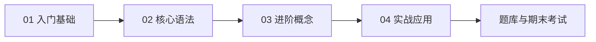

# C++ 语言

> 系统化 C++ 教程：两周学习指导（含 15 篇专栏全文）+ 14 主题速查 + 示例代码 + 按章题库 + 期末考试。建议先修 [C 语言](../c/)。

## 建议先修

本教程采用「混合定位」：与 C 重叠的基础内容会链接到 [C 语言教程](../c/)，C++ 增量特性（面向对象、STL、模板、智能指针等）在本专栏独立讲解。

**推荐**：至少完成 C 语言入门与核心语法后再进入 C++。

## 学习路径

| 阶段 | 入口 | 说明 |
|------|------|------|
| 两周计划 + 系统教程 | [学习指导/C++从入门到精通.md](学习指导/C++从入门到精通.md) | 14 天计划 + 附录 15 篇专栏全文 |
| 入门基础 | [附录 guide-01～04](学习指导/C++从入门到精通.md#guide-01) | 4 篇 |
| 核心语法 | [附录 guide-05～09](学习指导/C++从入门到精通.md#guide-05) | 5 篇 |
| 进阶概念 | [附录 guide-10～12](学习指导/C++从入门到精通.md#guide-10) | 3 篇 |
| 实战应用 | [附录 guide-13～15](学习指导/C++从入门到精通.md#guide-13) | 3 篇 |

完整大纲见 [syllabus.md](syllabus.md)。

## 内容索引

| 类型 | 入口 | 说明 |
|------|------|------|
| 系统教程 / 两周计划 | [学习指导/C++从入门到精通.md](学习指导/C++从入门到精通.md) | 按天练习 + 附录专栏全文 |
| 学习手册 | [学习手册/](学习手册/) | 指向学习指导（不双份维护） |
| 语法速查 | [references/](references/) | 14 主题汇总 |
| 代码示例 | [examples/](examples/) | 按 chapter01～chapter15 分章 |
| 练习题 | [exercises/](exercises/) | 日常练习（待补充） |
| 按章题库 | [题库/C++题库.md](题库/C++题库.md) | 14 主题：先题后答 + 知识点总结 |
| 期末考试 | [exams/](exams/) | 题型分册、大纲、复习计划 |
| 考试专题 | [certifications/university/cpp-language/](../../certifications/university/cpp-language/) | 考点对照与备考指南 |

> 原 `guides/` 分篇已收敛，仅保留 [重定向说明](guides/README.md)。

## 教程目录

正文与附录均在同一文件：[C++从入门到精通.md](学习指导/C++从入门到精通.md)。

### 01 入门基础

| 序号 | 文章 |
|------|------|
| 01 | [C++入门：从C到现代C++](学习指导/C++从入门到精通.md#guide-01) |
| 02 | [开发环境搭建](学习指导/C++从入门到精通.md#guide-02) |
| 03 | [程序结构：头文件、命名空间与编译链接](学习指导/C++从入门到精通.md#guide-03) |
| 04 | [数据类型、引用与auto](学习指导/C++从入门到精通.md#guide-04) |

### 02 核心语法

| 序号 | 文章 |
|------|------|
| 05 | [运算符与表达式：C++扩展特性](学习指导/C++从入门到精通.md#guide-05) |
| 06 | [流程控制](学习指导/C++从入门到精通.md#guide-06) |
| 07 | [循环结构](学习指导/C++从入门到精通.md#guide-07) |
| 08 | [数组、string与容器初探](学习指导/C++从入门到精通.md#guide-08) |
| 09 | [函数：重载、默认参数与内联](学习指导/C++从入门到精通.md#guide-09) |

### 03 进阶概念

| 序号 | 文章 |
|------|------|
| 10 | [类与对象：面向对象基础](学习指导/C++从入门到精通.md#guide-10) |
| 11 | [继承、多态与虚函数](学习指导/C++从入门到精通.md#guide-11) |
| 12 | [模板与STL基础](学习指导/C++从入门到精通.md#guide-12) |

### 04 实战应用

| 序号 | 文章 |
|------|------|
| 13 | [智能指针与RAII](学习指导/C++从入门到精通.md#guide-13) |
| 14 | [综合实战：面向对象学生管理系统](学习指导/C++从入门到精通.md#guide-14) |
| 15 | [学习路线与资源推荐](学习指导/C++从入门到精通.md#guide-15) |

## 相关章节

- C 语言基础：[languages/c/](../c/)
- 数据结构基础：[fundamentals/01-data-structures/](../../fundamentals/01-data-structures/)
- Linux 与编译实践：[engineering/02-linux-and-shell/](../../engineering/02-linux-and-shell/)
